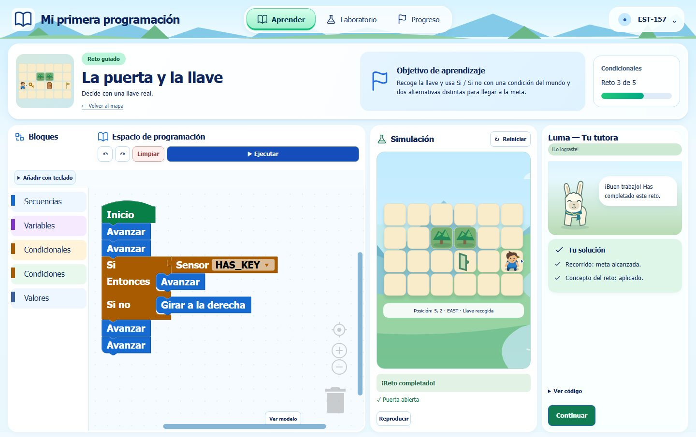

# MDEdu — herramienta educativa adaptativa MDE + LLM

Prototipo de tesis para enseñar lógica de programación a estudiantes universitarios de nivelación. Integra modelos formales, ejecución controlada, adaptación explicable y feedback opcional de lenguaje natural.

El contenido está cerrado: **SEQUENCES, VARIABLES, CONDITIONALS y LOOPS**, 18 retos guiados (4 Secuencias, 4 Variables, 5 Condicionales y 5 Ciclos), cero refuerzos reales y ningún tema avanzado. **Fases 0–13 completadas y validadas**; la evidencia de calidad final se registra en [Fase 13](docs/VERIFICACION_FASE_13.md).

## Demo / Deployment

Una sola aplicación Docker sirve React y Spring Boot en Render Free, con PostgreSQL en Neon y Gemini deshabilitado inicialmente. [Guía y acceso docente](docs/DESPLIEGUE_RENDER_NEON.md) · [Verificación](docs/VERIFICACION_DESPLIEGUE_RENDER_NEON.md). Aún no hay URL pública confirmada.

## Interfaz educativa

Aprender → mapa y retos · Laboratorio → experimentación libre · Progreso → avance persistente. Luma conserva el SVG anterior por preferencia expresa del usuario. [Diseño final](docs/REDISENO_VISUAL_FINAL.md) · [Verificación](docs/VERIFICACION_REDISENO_VISUAL_FINAL.md).



## Arquitectura

Blockly → Program EMF → validación → Acceleo → GridWorld → evaluación/patrones → StudentModel/ContextModel → Xtext/ECA → AdaptationManager → feedback LLM/fallback → UI MDE/ATL → React/Luma → telemetría → Meta-IU docente.

Java 21, Spring Boot 3.5.16, PostgreSQL 17/Flyway V1–V9; React 19, TypeScript, Vite y Blockly 13. Maven Wrapper 3.9.16; EMF, Xtext, Acceleo y ATL. Docker local incorpora Nginx; la imagen Render sirve todo desde Java. Ambos conservan health checks. No se ejecuta el JavaScript generado: GridWorld interpreta operaciones permitidas.

## Inicio en desarrollo (PowerShell)

Requisitos: Git, JDK 21, Node 24 (>=24.15.0, <25), Docker Desktop operativo con Linux containers. Resolver dependencias necesita red; no se requiere API LLM.

```powershell
git clone https://github.com/JonathanNevarez/MDEdu.git
cd MDEdu
Copy-Item .env.example .env
# Editar .env: DB_PASSWORD, META_UI_USERNAME y META_UI_PASSWORD propios.
$env:MAVEN_OPTS = '-Xmx384m'
.\backend\mvnw.cmd -f mde/pom.xml clean install
.\backend\mvnw.cmd -f backend/pom.xml verify
cd frontend
npm.cmd ci
npx.cmd playwright install chromium
cd ..
powershell -NoProfile -ExecutionPolicy Bypass -File scripts/start-dev.ps1
```

Abrir `http://127.0.0.1:5173/ingresar`. El docente provisiona código y clave desde `/docente` → Participantes; reglas y parámetros continúan en solo lectura. El login recupera el mismo progreso desde otro navegador. [Autenticación de estudiantes](docs/AUTENTICACION_ESTUDIANTES.md). La contraseña docente debe tener al menos 12 caracteres; no hay credenciales predeterminadas. Detener con `scripts/stop-dev.ps1`; los datos PostgreSQL se conservan.

## Docker completo

Configurar `.env` como arriba, `LLM_PROVIDER=DISABLED`, `CORS_ALLOWED_ORIGINS=http://127.0.0.1:8088`. Solo en HTTP local: `SESSION_COOKIE_SECURE=false`; en HTTPS productivo debe ser `true`.

```powershell
docker compose -f docker-compose.app.yml build backend
docker compose -f docker-compose.app.yml build frontend
docker compose -f docker-compose.app.yml up -d --wait
# http://127.0.0.1:8088
docker compose -f docker-compose.app.yml down
```

En equipos de 16 GB usar compilaciones secuenciales. `scripts/docker-smoke.ps1` limita el constructor a 1536 MiB y dos CPU, levanta una base nueva y prueba el flujo sin claves externas. Conserva los volúmenes; no modifica el PostgreSQL de desarrollo. Ver [despliegue y recuperación](docs/DESPLIEGUE.md).

## Configuración y proveedores

`.env.example` enumera DB, credenciales docentes, CORS, puerto, cookie y LLM. Nunca publicar `.env`. `DISABLED` mantiene todo el flujo mediante fallback determinista. `GEMINI` requiere `GEMINI_API_KEY`/`GEMINI_MODEL`; `OPENAI`, `LLM_API_KEY`/`LLM_MODEL`. `FAKE` se reserva para pruebas. Los proveedores no deciden la pedagogía; sus respuestas se validan y se sustituyen por fallback ante fallo, timeout o cuota. Las claves solo llegan al backend.

Cuotas: `LLM_RATE_LIMIT_REQUESTS`, `LLM_RATE_LIMIT_WINDOW_SECONDS`, `LLM_RATE_LIMIT_GLOBAL_REQUESTS`. Timeout/retries: `LLM_TIMEOUT_MS`, `LLM_MAX_RETRIES`. Son límites en memoria por instancia.

## Verificación

```powershell
powershell -NoProfile -ExecutionPolicy Bypass -File scripts/verify-all.ps1
```

Ejecuta secuencialmente MDE clean/install, backend clean/test/verify, frontend fresh install/tests/typecheck/build, Chromium E2E/axe, Gemini HTTP local, comprobación de secretos y smoke Docker. Fallos propagan código distinto de cero. No usa APIs externas reales. Evidencia detallada en [VERIFICACION_FASE_13](docs/VERIFICACION_FASE_13.md).

## Alcance y límites

La autenticación docente no reemplaza la identidad/autorización individual del estudiante: los identificadores estudiantiles son pseudónimos de prototipo. No es un sistema multiinstitución ni una plataforma pública lista para datos personales. El despliegue HTTPS, backups y gestión de credenciales corresponden al operador. Accesibilidad apunta a WCAG 2.2 AA con evaluación automatizada y casos principales; no es una certificación y Blockly conserva limitaciones.

- [Seguridad y fronteras](docs/SEGURIDAD.md)
- [Accesibilidad](docs/ACCESIBILIDAD.md)
- [API](docs/API.md)
- [Arquitectura](docs/ARQUITECTURA.md)
- [Estado e historia](docs/ESTADO_PROYECTO.md)
- [Plan de implementación](docs/PLAN_IMPLEMENTACION.md)
