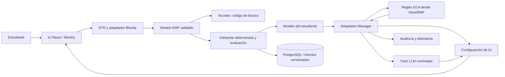
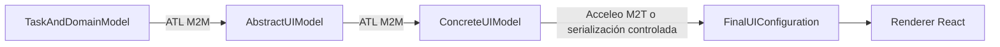
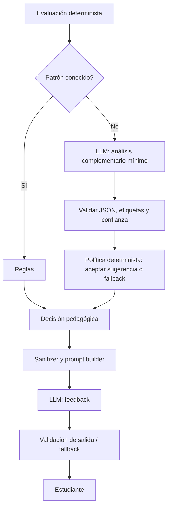

# Arquitectura inicial

Estado: diseño objetivo. En esta entrega solo existen los componentes de arranque
de Fase 0. Ningún diagrama implica que el ciclo pedagógico esté implementado.

## Responsabilidades y límites

| Componente del marco | Responsabilidad | Ubicación objetivo |
| --- | --- | --- |
| Contexto de uso | Estudiante de nivelación, plataforma PC/laptop, aula/hogar/conectividad mínima | context.ecore, student y Context Probe |
| Sistema de software | IU, modelos, validación, intérprete y evaluación | frontend, mde, programming/execution/evaluation |
| Adaptador inteligente | Parámetros, reglas ECA, manager, tutor, transiciones y Meta-IU | adaptation, llm, frontend |
| Fuentes externas | Banco de ejercicios, grafo, currículo, docente y API LLM | activity, semillas/versiones y adaptadores |
| Soporte transversal | PostgreSQL, eventos, versiones y correlación | persistence y telemetry |

El frontend presenta datos/decisiones del servidor; usa React Router y, cuando
sea necesario, Context + reducer. Blockly no es el modelo canónico. El backend
adopta paquetes por capacidad con dominio, aplicación, infraestructura y API.
Controladores validan DTOs y delegan; no evalúan reglas ni actualizan el dominio
por sí mismos. JPA no se expone en REST. El código EMF/Xtext generado se aísla.

## Cadena MDE de interfaz

Las transformaciones conservan IDs origen/destino y versiones. Se transforma
configuración, sin generar una aplicación React distinta por estudiante.

## Ciclo de intento objetivo

1. Cargar actividad, estudiante y contexto; devolver configuración inicial.
2. Recibir DTO limitado del Workspace y construir modelo EMF.
3. Validar, analizar y generar código Acceleo; interpretar modelo/IR seguro.
4. Evaluar semántica, restricciones y concepto esperado; identificar patrones.
5. Actualizar dominio mediante parámetros versionados, una sola vez por intento.
6. Resolver reglas y construir decisión con explicación; seleccionar actividad
   usando grafo, prerrequisitos, dificultad, errores, ritmo y ayudas.
7. Solicitar texto pedagógico controlado; persistir resultado, decisión y feedback.
8. Devolver configuración; renderer y Transitioner comunican el cambio.

La transacción guarda el resultado pedagógico aunque el LLM falle. Una llamada
externa lenta no debe mantener bloqueos de BD; la fase de LLM definirá cómo
persistir feedback posterior sin reevaluar el intento.

## LLM subordinado a reglas

El proveedor no recibe acceso a BD, reglas, funciones ejecutables ni acciones
arbitrarias. No modifica masteryScore, dificultad o navegación. FakeLlmProvider
permite probar la aplicación sin red. Los nombres/correos/IDs externos no entran
en prompts. El tutor visual será una llama, sin chat general abierto.

## Persistencia y trazabilidad previstas

Tablas: students, concepts, student_concept_mastery, activities, activity_concepts,
attempts, attempt_events, detected_errors, adaptation_decisions, feedback_records,
adaptation_rules_metadata, adaptation_parameters y sessions. Se crean en las fases
que las utilizan; F0 solo inicia el historial de migraciones.

Un intento enlaza activityId, studentId interno, sessionId, requestId, modelo y
versión del metamodelo, versión/hash de transformaciones, reglas/parámetros activos,
resultado, decisión y feedback. Eventos incluyen eventId, studentId, sessionId,
activityId, eventType, timestamp y payload estructurado. AdaptationAuditRecord
añade reglas evaluadas/coincidentes/seleccionadas/descartadas, explicación y uso
LLM/prompt type. No se registran secretos ni prompts completos con datos personales.

El nivel gamificado y puntos se mantienen separados de masteryScore. No se infieren
atributos sensibles ni se usan cámara, micrófono, biometría o sensores personales.

## Lectura del marco adjunto

Ver [SVG de referencia](referencias/marco_conceptual_iu_adaptativa_programacion.svg).
Se conserva la separación en cuatro componentes. ML se considera futuro como
ordena la solicitud. El texto del núcleo en el dibujo se concreta mediante un
intérprete seguro y M2T visible. No existe la tabla de propiedades numéricas citada
en el SVG entre los materiales recibidos.
