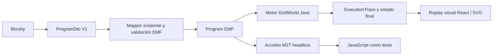
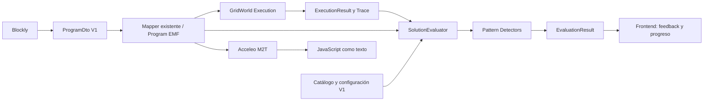
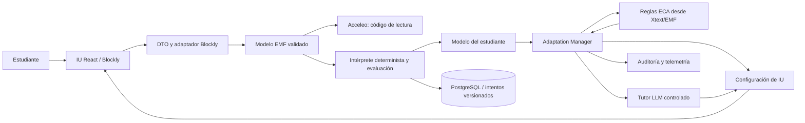
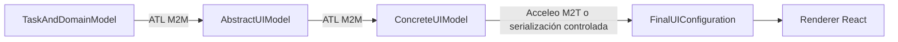
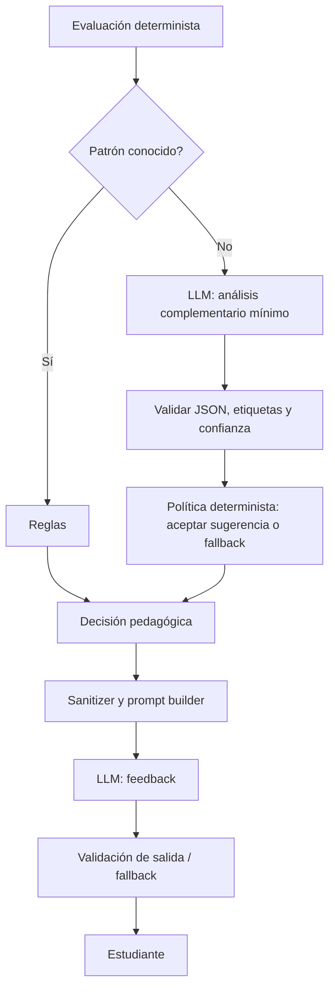
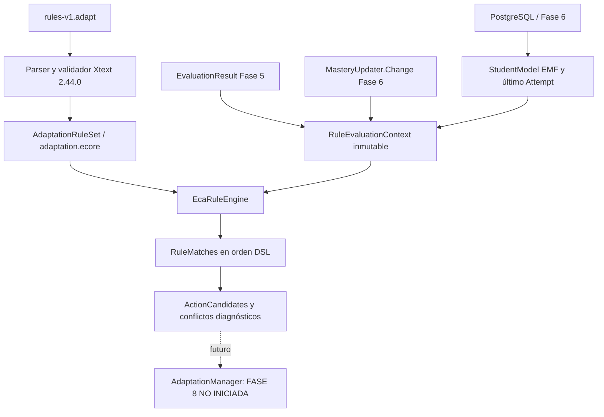
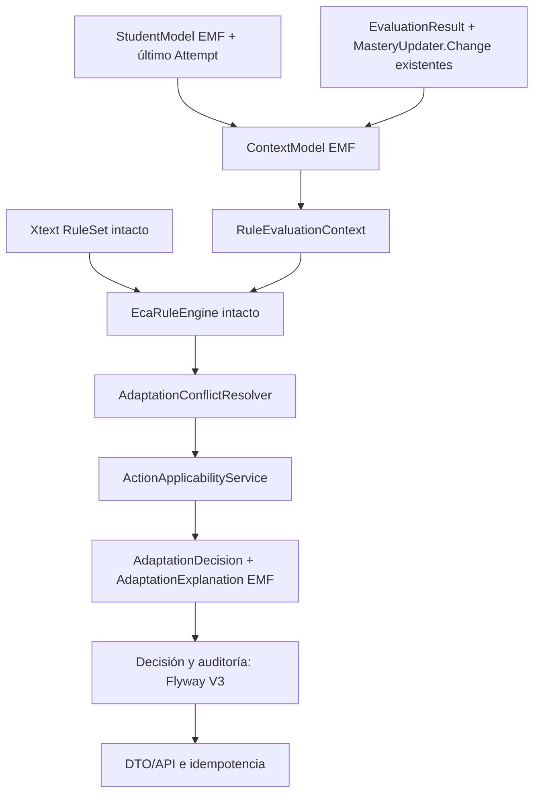
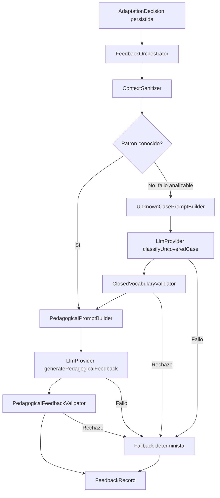

# Arquitectura inicial

## Evolución post-prototipo: catálogo guiado de 18 retos

LevelCatalog carga `challenges.v1.json` y PatternCatalog su evaluación correspondiente, conservando la configuración histórica para interpretar evidencia. Criteria comprueba exclusivamente el modelo EMF y la traza real; no añade primitivas ni compara código. La semántica del intérprete permanece: solo se añade VARIABLE_READ a la traza para comprobar lecturas reales, incluso con cortocircuito. Los activos MDE permanecen intactos.

LearningService combina ConceptGraph/prerequisites/mastery con el predecesor dentro de cada concepto bajo el bloqueo transaccional existente del estudiante. V9 archiva las cuatro Activities originales y añade 18 Activities/Progress sin modificar historial, cuentas ni dominio. DTOs de progreso agregan totales y reto actual por concepto. UiConfigurationService reutiliza la base ATL del concepto y vincula el ID del reto en memoria. Meta-IU proyecta la lista completa. [Diseño y mundos](CATALOGO_RETOS.md).

## Evolución post-prototipo: identidad persistente

`StudentAccount → Student(UUID) → StudentModel / progreso / intentos / adaptación / feedback / telemetría`.
V8 añade cuentas y una secuencia concurrente; no reemplaza las entidades de aprendizaje. Spring Security mantiene una sesión HTTP con principal Student y ROLE_STUDENT; los endpoints validan ownership. ROLE_TEACHER administra participantes y consulta la evidencia. Las sesiones de telemetría siguen siendo entidades independientes. Reset/disable revocan mediante credential_version consultada en cada request. El frontend consulta `/me`; localStorage deja de ser autoridad.

Fases 0–13 cerradas, sin Fase 14. [Diseño de autenticación](AUTENTICACION_ESTUDIANTES.md). Las secciones siguientes conservan la evolución histórica de la arquitectura.

Estado: los diagramas generales describen el diseño objetivo. Ya existen el
arranque de Fase 0, el metamodelo de Fase 1 y el flujo estructural de Fase 2
descrito a continuación, el M2T aislado de Fase 3 y el juego determinista de Fase 4.
La evaluación determinista de Fase 5 y el modelo/persistencia de aprendizaje de Fase 6 están implementados. El ciclo adaptativo completo sigue siendo diseño futuro.

## Flujo implementado en Fase 2

`Blockly → ProgramDto V1 → Spring API → mapper → Program EMF → Diagnostician → XMI`.
El mapper resuelve variables en dos pasadas mediante referencias EObject reales.
El modelo generado de Fase 1 se consume como artefacto Maven, sin modificarlo.
La API opera en memoria y no añade persistencia DB. El workspace visual se guarda
y restaura con serialización Blockly en localStorage. ProgramDto transporta el
programa; Program EMF sigue siendo el modelo canónico. El cliente HTTP está
separado del adaptador Blockly. Detalles: [Fase 2](FASE_2_BLOCKLY_MODELO_EMF.md).

## Transformación implementada en Fase 3

Flujo disponible: **Blockly → ProgramDto V1 → Program EMF → Acceleo M2T → JavaScript**.
El último tramo es un launcher headless separado; no hay conexión automática UI/API
al generador. `com.project.mde.programming.generator` consume el plugin formal y
nsURI existente. Las plantillas Acceleo generan llamadas a una API runtime cerrada,
sin ejecutar el programa. Modelo, DTO y adaptadores Fase 2 permanecen intactos.
GridWorld se incorporó en Fase 4; no utiliza el JavaScript generado.
[Mapping, contrato y comandos](FASE_3_M2T_ACCELEO.md).

## Juego implementado en Fase 4

```mermaid
flowchart LR
  B[Blockly] --> D[ProgramDto V1]
  D --> M[Mapper existente y validación EMF]
  M --> P[Program EMF]
  P --> G[Motor GridWorld Java]
  G --> T[ExecutionTrace y estado final]
  T --> R[Replay visual React / SVG]
  P --> A[Acceleo M2T headless]
  A --> J[JavaScript como texto]
```

El motor interpreta EMF; no ejecuta el JavaScript de Acceleo. Catálogo JSON versionado
con cuatro niveles; desbloqueo por prerequisites declarativas. Progreso local provisional,
sin persistencia DB. API en execution/api; motor de dominio Java independiente de Spring.
El replay consume snapshots del servidor. `/aventura` y `/aventura/:levelId` conviven
con `/laboratorio`. [Semántica y límites](FASE_4_GRIDWORLD_JUEGO.md).
El StudentModel se incorporó en Fase 6; reglas ECA y LLM siguen siendo diseño futuro.

## Evaluación implementada en Fase 5

```mermaid
flowchart LR
  B[Blockly] --> D[ProgramDto V1]
  D --> P[Mapper existente / Program EMF]
  P --> G[GridWorld Execution]
  G --> T[ExecutionResult y Trace]
  T --> E[SolutionEvaluator]
  P --> E
  C[Catálogo y configuración V1] --> E
  E --> PD[Pattern Detectors]
  PD --> ER[EvaluationResult]
  ER --> F[Frontend: feedback y progreso]
  P --> A[Acceleo M2T]
  A --> J[JavaScript como texto]
```

`evaluation/domain`, `application`, `catalog`, `detectors` y `api` separan análisis,
orquestación y contrato. No hay segundo motor ni mapper. Un POST reutiliza una
sola ejecución para obtener las cuatro dimensiones y activityPassed.
Exactamente 15 patrones y cuatro configuraciones JSON versionadas; paths,
fingerprints y evidencia deterministas sobre EMF/traza. El frontend acredita
completion solo con activityPassed; el progreso local es monotónico.
Fase 5 no añadió DB ni StudentModel; Fase 6 los incorpora como se detalla abajo. Los diagramas generales siguientes
son **objetivos futuros**, salvo los componentes expresamente implementados arriba.
[Diseño y límites](FASE_5_EVALUACION_PEDAGOGICA.md).

## Modelo del estudiante implementado en Fase 6

`Program EMF → execution → evaluation → Attempt → MasteryUpdater → PostgreSQL
→ StudentModel EMF validado → ModelDto/ProgressDto → aventura`.

Plugin independiente learning.ecore → learning.genmodel → 26 fuentes EMF generadas.
JPA almacena estado normalizado mediante Flyway V2; StudentModelProjectionService
construye la proyección con LearningFactory y valida antes de devolver DTOs.
El snapshot contiene catálogos para resolver referencias XMI; no se guarda como blob.

Política JSON V1: .10/.05/-.03 y -.02 por error repetido; grafo desde relaciones
persistidas, threshold .05 y unlock/completion monotónicos. POST attempts serializa
por Student mediante lock de fila, ejecuta una vez y persiste atómicamente.
El endpoint execute de Fase 5 permanece stateless y determinista.

La aventura conserva solo studentId local y recibe progreso de backend. Identidad
pseudónima sin login, exactamente cuatro actividades actuales. No adaptación,
reglas ECA, Xtext ni LLM implementados. [Diseño](FASE_6_MODELO_ESTUDIANTE.md).

## Responsabilidades y límites

| Componente del marco | Responsabilidad | Ubicación objetivo |
| --- | --- | --- |
| Contexto de uso | Estudiante de nivelación, plataforma PC/laptop, aula/hogar/conectividad mínima | context.ecore, student y Context Probe |
| Sistema de software | IU, modelos, validación, intérprete y evaluación | frontend, mde, programming/execution/evaluation |
| Adaptador inteligente | Parámetros, reglas ECA, manager, tutor, transiciones y Meta-IU | adaptation, llm, frontend |
| Fuentes externas | Banco de ejercicios, grafo, currículo, docente y API LLM | activity, semillas/versiones y adaptadores |
| Soporte transversal | PostgreSQL, eventos, versiones y correlación | persistence y telemetry |

El frontend presenta datos/decisiones del servidor; usa React Router y, cuando
sea necesario, Context + reducer. Blockly no es el modelo canónico. El backend
adopta paquetes por capacidad con dominio, aplicación, infraestructura y API.
Controladores validan DTOs y delegan; no evalúan reglas ni actualizan el dominio
por sí mismos. JPA no se expone en REST. El código EMF/Xtext generado se aísla.

```mermaid
flowchart LR
  S[Estudiante] --> UI[IU React / Blockly]
  UI --> API[DTO y adaptador Blockly]
  API --> EMF[Modelo EMF validado]
  EMF --> M2T[Acceleo: código de lectura]
  EMF --> EV[Intérprete determinista y evaluación]
  EV --> SM[Modelo del estudiante]
  SM --> AM[Adaptation Manager]
  AM --> RE[Reglas ECA desde Xtext/EMF]
  RE --> AM
  AM --> LLM[Tutor LLM controlado]
  AM --> CFG[Configuración de IU]
  LLM --> CFG
  CFG --> UI
  EV --> DB[(PostgreSQL / intentos versionados)]
  AM --> AUD[Auditoría y telemetría]
```

## Cadena MDE de interfaz

```mermaid
flowchart LR
  TD[TaskAndDomainModel] -->|ATL M2M| AUI[AbstractUIModel]
  AUI -->|ATL M2M| CUI[ConcreteUIModel]
  CUI -->|Acceleo M2T o serialización controlada| FUI[FinalUIConfiguration]
  FUI --> R[Renderer React]
```

Las transformaciones conservan IDs origen/destino y versiones. Se transforma
configuración, sin generar una aplicación React distinta por estudiante.

## Ciclo de intento objetivo

1. Cargar actividad, estudiante y contexto; devolver configuración inicial.
2. Recibir DTO limitado del Workspace y construir modelo EMF.
3. Validar, analizar y generar código Acceleo; interpretar modelo/IR seguro.
4. Evaluar semántica, restricciones y concepto esperado; identificar patrones.
5. Actualizar dominio mediante parámetros versionados, una sola vez por intento.
6. Resolver reglas y construir decisión con explicación; seleccionar actividad
   usando grafo, prerrequisitos, dificultad, errores, ritmo y ayudas.
7. Solicitar texto pedagógico controlado; persistir resultado, decisión y feedback.
8. Devolver configuración; renderer y Transitioner comunican el cambio.

La transacción guarda el resultado pedagógico aunque el LLM falle. Una llamada
externa lenta no debe mantener bloqueos de BD; la fase de LLM definirá cómo
persistir feedback posterior sin reevaluar el intento.

## LLM subordinado a reglas

```mermaid
flowchart TD
  E[Evaluación determinista] --> P{Patrón conocido?}
  P -->|Sí| R[Reglas]
  P -->|No| U[LLM: análisis complementario mínimo]
  U --> V[Validar JSON, etiquetas y confianza]
  V --> G[Política determinista: aceptar sugerencia o fallback]
  R --> D[Decisión pedagógica]
  G --> D
  D --> B[Sanitizer y prompt builder]
  B --> L[LLM: feedback]
  L --> F[Validación de salida / fallback]
  F --> S[Estudiante]
```

El proveedor no recibe acceso a BD, reglas, funciones ejecutables ni acciones
arbitrarias. No modifica masteryScore, dificultad o navegación. FakeLlmProvider
permite probar la aplicación sin red. Los nombres/correos/IDs externos no entran
en prompts. El tutor visual será una llama, sin chat general abierto.

## Persistencia y trazabilidad previstas

Tablas: students, concepts, student_concept_mastery, activities, activity_concepts,
attempts, attempt_events, detected_errors, adaptation_decisions, feedback_records,
adaptation_rules_metadata, adaptation_parameters y sessions. Se crean en las fases
que las utilizan; F0 solo inicia el historial de migraciones.

Un intento enlaza activityId, studentId interno, sessionId, requestId, modelo y
versión del metamodelo, versión/hash de transformaciones, reglas/parámetros activos,
resultado, decisión y feedback. Eventos incluyen eventId, studentId, sessionId,
activityId, eventType, timestamp y payload estructurado. AdaptationAuditRecord
añade reglas evaluadas/coincidentes/seleccionadas/descartadas, explicación y uso
LLM/prompt type. No se registran secretos ni prompts completos con datos personales.

El nivel gamificado y puntos se mantienen separados de masteryScore. No se infieren
atributos sensibles ni se usan cámara, micrófono, biometría o sensores personales.

## Lectura del marco adjunto

Ver [SVG de referencia](referencias/marco_conceptual_iu_adaptativa_programacion.svg).
Se conserva la separación en cuatro componentes. ML se considera futuro como
ordena la solicitud. El texto del núcleo en el dibujo se concreta mediante un
intérprete seguro y M2T visible. No existe la tabla de propiedades numéricas citada
en el SVG entre los materiales recibidos.

## Fase 7 implementada — evaluación de candidatos

```mermaid
flowchart TD
  DB[PostgreSQL / Fase 6] --> SM[StudentModel EMF y último Attempt]
  EV[EvaluationResult Fase 5] --> CT[RuleEvaluationContext inmutable]
  CH[MasteryUpdater.Change Fase 6] --> CT
  SM --> CT
  DSL[rules-v1.adapt] --> XT[Parser y validador Xtext 2.44.0]
  XT --> EMF[AdaptationRuleSet / adaptation.ecore]
  EMF --> ECA[EcaRuleEngine]
  CT --> ECA
  ECA --> RM[RuleMatches en orden DSL]
  RM --> AC[ActionCandidates y conflictos diagnósticos]
  AC -. futuro .-> AM[AdaptationManager: FASE 8 NO INICIADA]
```

AdaptationRuleLoader valida al startup. RuleEvaluationService es un servicio de
consulta explícita de candidatos; el flujo REST y las transacciones de aprendizaje
anteriores no se modifican. No hay endpoint nuevo. ECA no guarda decisiones ni
aplica acciones; priority no elige ganador. Contexto sin JPA/EObjects y resultados
inmutables/deterministas. Catálogos pedagógicos existentes, sin migraciones nuevas.
Los diagramas de arquitectura objetivo anteriores siguen siendo propuestas para
fases posteriores cuando incluyen LLM, UI adaptativa o decisiones persistentes.

## Fase 8 implementada — decisión y auditoría

```mermaid
flowchart TD
  SM[StudentModel EMF + último Attempt] --> CT[ContextModel EMF]
  EV[EvaluationResult + MasteryUpdater.Change existentes] --> CT
  CT --> RC[RuleEvaluationContext]
  DSL[Xtext RuleSet intacto] --> ECA[EcaRuleEngine intacto]
  RC --> ECA
  ECA --> CR[AdaptationConflictResolver]
  CR --> AP[ActionApplicabilityService]
  AP --> DE[AdaptationDecision + AdaptationExplanation EMF]
  DE --> DB[Decisión y auditoría: Flyway V3]
  DB --> API[DTO/API e idempotencia]
```

AdaptationManager orquesta. POST attempts captura evidencia y decide en la misma
transacción después de la única ejecución/evaluación y proyección del estudiante.
POST adaptation/decide carga evidencia del intento, nunca contexto cliente o mastery
actual para reinterpretar el pasado. Decision/rule audit/action audit atómicos,
lock por estudiante y constraint única por intento/versiones.

El manager decide intenciones; React, Luma y el feedback Fase 5 no cambian.
LLM = Fase 9, NO INICIADA. UI adaptativa completa = Fase 10, NO INICIADA.

## Implementado en Fase 9 — LLM posterior a decisión

```mermaid
flowchart TD
  A[AdaptationDecision persistida] --> F[FeedbackOrchestrator]
  F --> S[ContextSanitizer]
  S --> K{Patrón conocido?}
  K -->|Sí| P[PedagogicalPromptBuilder]
  K -->|No, fallo analizable| U[UnknownCasePromptBuilder]
  U --> C[LlmProvider classifyUncoveredCase]
  C --> V[ClosedVocabularyValidator]
  V --> P
  P --> L[LlmProvider generatePedagogicalFeedback]
  L --> O[PedagogicalFeedbackValidator]
  O --> R[FeedbackRecord]
  C -->|Fallo| B[Fallback determinista]
  L -->|Fallo| B
  V -->|Rechazo| B
  O -->|Rechazo| B
  B --> R
```

El intento captura evidencia mínima sin invocar red. La llamada externa no mantiene
transacción educativa ni lock de estudiante. Advisory lock de sesión serializa la
misma generación; guardado final de feedback/tags/auditoría es atómico.
Fase 9 no modifica StudentModel ni acciones/fingerprint. API Responses por HttpClient,
Fake determinista y fallback local disponibles. Sin key la aplicación funciona.

Abstracción ampliada después de Fase 10: `LlmProvider` → `OpenAILlmProvider`,
`GeminiLlmProvider`, `FakeLlmProvider`, `DisabledLlmProvider`.
La factory selecciona por configuración; Gemini usa Interactions v1 con los mismos
contratos y validadores. [Integración temporal](INTEGRACION_GEMINI_TEMPORAL.md).

UI adaptativa completa, Luma y Transitioner siguen siendo Fase 10 NO INICIADA.
[Diseño y límites](FASE_9_LLM.md).

## Extensión de Fase 10: presentación adaptativa

Blockly → Program EMF → ejecución → evaluación → StudentModel → ContextModel →
Xtext/ECA → AdaptationManager → AdaptationDecision → feedback opcional → UI MDE →
FinalUIConfiguration → DTO → React. Task→Abstract→Concrete se ejecuta realmente
con ATL en el build headless. El backend consume las bases XMI verificadas.
La configuración derivada se solicita después del intento y al refrescar.
Una proyección fallida no revierte el aprendizaje persistido; devuelve safe default.
V5 autorizada conserva únicamente el programa original por intento para Acceleo de lectura.

## Fase 11 — observación del flujo

Request → CorrelationContext/MDC → Session → pipeline de intento → TelemetryRecorder
→ attempt_events → AttemptTimelineService/AttemptReconstruction.

La telemetría no controla pedagogía. Los hitos críticos del intento comparten su
transacción; los eventos de feedback comparten el guardado de feedback. La configuración
UI se audita después de calcularse. La reconstrucción solo lee evidencia persistida.
Sesión/requestId se propagan desde el cliente central; los tipos de evento frontend están
limitados a apertura y navegación. No hay nuevo metamodelo ni providers modificados.
[Diseño y límites](FASE_11_TELEMETRIA.md).

## Fase 12 — Meta-IU docente implementada

`/docente → MetaUiService → StudentModelProjectionService / progreso / decisiones persistidas`.
`/docente → AdaptationInspectionService → AdaptationRuleLoader + AdaptationParametersConfig`.
`/docente → AttemptTimelineService → evidencia histórica de Fase 11`.

Solo lectura: las consultas no invocan comandos educativos, provider ni proyección UI.
Listas paginadas, timeline bajo demanda y DTOs pseudónimos. No hay dominio ni BD duplicada,
ni V8. Reglas/parametrización activos se inspeccionan en sus instancias de runtime.
No existe auth/roles de producción: control de acceso robusto pendiente de hardening final.
Capacidades de mutación y revisión de propuestas falsas; futuras capas de governance
requieren autorización real antes de exponer writes. [Diseño](FASE_12_META_UI.md).

## Fronteras de calidad de Fase 13

La tubería pedagógica y sus modelos no cambian. Spring Security delimita rutas docentes con sesión/CSRF, mientras en ese checkpoint la API estudiantil conservaba su contrato anónimo (reemplazado por autenticación post-prototipo, descrita al inicio). Filtros limitan payload y correlacionan solicitudes; advice normaliza errores. Un limitador sincronizado y acotado cobra cada intento HTTP de proveedores externos. React incorpora ErrorBoundary, cliente HTTP compartido y guard docente, respaldado por enforcement en backend.

El despliegue completo usa Nginx sin root para SPA/proxy `/api`, backend Java 21 sin root y PostgreSQL en volumen independiente. Health coordina el orden DB/backend/frontend. Dockerfiles multietapa construyen artefactos MDE desde fuente. El Compose anterior de DB local permanece intacto. Ver SEGURIDAD.md y DESPLIEGUE.md para límites y operación.
