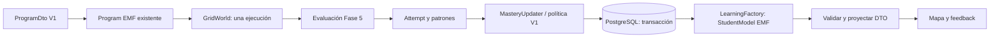

# Fase 6 — Modelo del estudiante

## Modelo formal y responsabilidades

Plugin independiente `mde/com.project.mde.learning.model`, integrado en el reactor
Tycho junto a programming.model y Acceleo. `model/learning.ecore` es la fuente
formal, `model/learning.genmodel` configura Java 21 y el plugin ID. EMF generó
26 fuentes en src-gen; no se editaron manualmente. nsURI:
`https://mdedu.espoch.edu.ec/model/learning/1.0`.

| EClass | Papel y relaciones |
| --- | --- |
| Student | UUID opaco, displayName opcional y createdAt; sin correo, contraseña ni autenticación. |
| StudentModel | Raíz versión 1; contiene Student, catálogos, masteries, intentos recientes, hintUsages y progress; lastUpdated. |
| Concept | ID string extensible, nombre, prerequisites, threshold, activities[*] y reinforcementActivities[*]. |
| ConceptMastery | Referencia Student/Concept; mastery, contadores, fallos consecutivos, promedio de tiempo, pistas, fecha y patrones recientes. |
| LearningObjective | ID, descripción y Concept; un objetivo proyectado por actividad actual. |
| Activity | ID real del juego, título, Concept y learningObjectives. |
| Attempt | ID, Student, Activity/Concept, successful pedagógico, functionalPassed, duración, pistas, fecha y patrones. |
| ErrorPattern | Referencia formal al catálogo de Fase 5: ID, Concept, severity y significado. |
| HintUsage | ID, Student, Activity, hintLevel y usedAt; lista vacía en el flujo UI actual. |
| Progress | Activity/Concept, completed, unlocked y completedAt opcional. |

StudentModel contiene sus catálogos para que las referencias sean internas al
snapshot XMI. `LearningModels.validate` complementa Diagnostician: rangos finitos,
contadores no negativos/coherentes, mastery 0..1, promedio no negativo, unicidad
de conceptos/actividades/masteries y referencias internas/resueltas. La utilidad
manual reside en src/.../validation, separada de src-gen.

Los ejemplos `examples/student-a.learning` y `student-b.learning` fueron obtenidos
mediante el servicio real desde Testcontainers. A tiene un éxito y mastery .10;
B un fallo y mastery .00. Se verifica load/validate/save/unload/reload/validate.

## Persistencia relacional y proyección

Flyway existente tenía solo V1. Se agrega **V2__learning_model.sql** sin editar V1.
Diez tablas normalizadas:

- students
- concepts
- concept_prerequisites
- learning_activities
- error_patterns
- student_concept_mastery
- attempts
- attempt_error_patterns
- student_activity_progress
- hint_usages

UUID en estudiantes/intentos/filas de estado; claves únicas estudiante-concepto y
estudiante-actividad, referencias FK y checks de rangos/contadores. No se almacena
XMI, StudentModel gigante ni blob de evaluación como persistencia principal.
`attempt_error_patterns` preserva orden y unicidad de IDs detectados.
`attempts.student_ordinal` da orden total por estudiante incluso con timestamps
iguales, protegido por la transacción. Índice para historial reciente por concepto.

JPA solo modela persistencia. StudentRepository usa Spring Data JPA; LearningStore
con EntityManager realiza consultas acotadas. LearningService orquesta; MasteryUpdater
y ConceptGraphService contienen reglas separadas. DTOs REST no exponen entidades.

`StudentModelProjectionService.project` lee persistencia en una transacción de
lectura REPEATABLE_READ y utiliza **LearningFactory.eINSTANCE**. Construye los
catálogos, enlaza referencias por ID, valida EMF y después produce ModelDto y
ProgressDto. El backend consume el JAR learning por dependencia Maven normal,
instalado desde el reactor; no copia src-gen, no usa systemPath ni target como
dependencia directa.

El snapshot/API incluye los últimos 20 intentos globales, sin truncar contadores
ni el historial relacional. Patrones recientes se calculan separadamente con la
ventana por concepto. Los objetivos actuales son una proyección determinista del
catálogo de actividades (ID OBJECTIVE_ + activityId y descripción a partir del
concepto/título); no constituyen un currículo adicional persistido.

## Flujo rastreado y transacción

POST attempts toma `PESSIMISTIC_WRITE` sobre la fila Student. Todos los intentos
del mismo estudiante, incluso de conceptos distintos, quedan serializados. No
hay locks globales entre estudiantes. Student también tiene @Version; la garantía
principal frente a lost updates es el lock de fila. Crear Attempt/patrones,
actualizar mastery/contadores, completion y unlock histórico ocurre en una sola
transacción. Un fallo revierte todo; la respuesta se entrega después del commit.
Los tests comprueban rollback y dos escrituras concurrentes reales.

Se llama a GameExecutionService exactamente una vez. Su execution/evaluation se
reutiliza al guardar, sin volver a mapear ni ejecutar. El endpoint original
`/api/game/levels/{levelId}/execute` permanece sin estudiante y byte-determinista;
UUID y timestamps solo aparecen en el nuevo contrato rastreado.

## Política V1 transparente

Archivo `backend/src/main/resources/learning/student-model-policy.v1.json`:

| Parámetro | Valor |
| --- | --- |
| version | 1 |
| initialMastery | 0.0 |
| successWithoutHintDelta | +0.10 |
| successWithHintDelta | +0.05 |
| failureDelta | -0.03 |
| repeatedErrorDelta | -0.02 |
| recentErrorWindow | 5 |
| maxRecentErrorPatterns | 10 |

Éxito significa evaluation.activityPassed, no success funcional. Si un patrón
actual apareció en los cinco intentos **previos del mismo concepto**, se agrega
-.02 una sola vez, aunque haya varios patrones repetidos. La comparación puede
aplicar también a un éxito con advertencias repetidas. Después se aplica clamp
0..1. Sumas decimales mediante BigDecimal evitan deriva binaria de los deltas.

La respuesta masteryUpdate y la fila Attempt conservan before, delta de política
**antes de clamp**, after y razones: ACTIVITY_SUCCESS_NO_HINT,
ACTIVITY_SUCCESS_WITH_HINT, ACTIVITY_FAILURE, REPEATED_ERROR_PATTERN,
MASTERY_CLAMPED. Si before=0 y delta=-.05, after=0; delta describe la regla y no
pretende ser after-before. No hay nota, ranking ni adaptación de dificultad.

Por concepto: attemptCount +1, successCount o failureCount +1. Fallo incrementa
consecutiveFailures; éxito lo reinicia a cero. Promedio incremental en milisegundos:
`previousAverage + (duration - previousAverage) / newAttemptCount`.
Tiempo cliente aceptado 0..86 400 000 ms (24 h); hintCount 0..100. La UI mide con
performance.now y envía cero pistas; no se fabrican HintUsage. La API permite
comprobar la rama con pistas mediante un conteo declarado. hint_usages queda vacía
hasta que exista un mecanismo real de pistas.

Fechas persistidas de Instant.now del servidor, PostgreSQL timestamptz y JSON UTC.
EDate XMI preserva el mismo instante con el offset escrito por el serializador.
El reloj cliente no establece createdAt/submittedAt/lastUpdated.

Patrones recientes: últimos cinco intentos del concepto **incluyendo el actual**,
orden student_ordinal descendente, luego orden de detección Fase 5; IDs únicos por
primera aparición, máximo diez. El historial no mezcla estudiantes ni conceptos.

## Grafo y progreso

Datos persistidos: SEQUENCES → VARIABLES → CONDITIONALS → LOOPS mediante filas
concept_prerequisites. Cuatro conceptos, cuatro actividades principales con los
IDs de levels.v1.json, cero actividades de refuerzo. Ningún ID de Concept es enum
EMF/JPA. Las cardinalidades permiten varias actividades/refuerzos futuros.

ConceptGraphService recibe nodos, prerequisites y estado; no usa switch por ID,
orden +1 ni índices del mapa. Rechaza ciclos y referencias desconocidas. Un test
con A → B y A → C demuestra una bifurcación sin cambiar algoritmo.

Un nodo sin prerequisites se desbloquea inicialmente. Para cada prerequisite se
exige successCount >0 y mastery >= su minimumMasteryToUnlock, actualmente **.05**.
Un éxito sin pistas (.10) o con pistas (.05) permite avanzar. Un fallo inicial no.
`unlocked_at` registra que el requisito ya fue satisfecho; nunca se borra por una
bajada posterior de mastery. `completed_at` registra el primer éxito y tampoco se
borra. Así se distinguen mastery dinámico, completed histórico y unlocked histórico.
El POST rastreado de una actividad aún bloqueada devuelve 409 sin ejecutar ni guardar.

## Identidad y frontend

Al abrir aventura, ensureStudent crea una identidad si falta y consulta progress;
si existe la reutiliza. Creaciones concurrentes de la misma página comparten una
promesa para evitar duplicación por StrictMode. localStorage conserva únicamente
la identidad de aprendizaje en `mdedu.student.id.v1`; no guarda StudentModel.
La persistencia del laboratorio libre sigue separada e intacta.

Un 404 de identidad obsoleta permite una sola recreación y recarga; un error de red
no sustituye la identidad. Si falla la identidad nueva, se muestra error sin bucle.
Sin localStorage, la identidad dura en memoria durante esa sesión.

El progreso provisional `mdedu.game.progress.v1` se ignora y se elimina tras una
inicialización correcta; no se convierte en mastery. Los helpers históricos de
progress.ts/applyEvaluation se conservan para regresión, pero AdventurePage no los
usa: estado locked/unlocked/completed y actualizaciones vienen exclusivamente del
ProgressDto del backend. Un intento fallido también actualiza los contadores,
conservando feedback de Fase 5. Replay no produce otra petición/intento.
No se rediseña el mapa ni se añade dashboard.

## Límites

Identidad pseudónima de prototipo, sin login ni recuperación entre dispositivos.
No es un mecanismo de autenticación; conocer el UUID permite consultar ese estado.
Tiempos/pistas son datos declarados por el cliente y no calificación certificada.
Cada POST válido es un intento nuevo; no se implementa idempotencia entre reenvíos
independientes. La proyección de intentos está acotada; no hay pantalla histórica.
No se seleccionan actividades automáticamente, no se decide refuerzo ni se altera
la UI por mastery. Sin adaptation.ecore, context.ecore, Xtext, ECA ni LLM.
Se conservan los cuatro fundamentos básicos; Fase 7 no iniciada.

[Verificación](VERIFICACION_FASE_6.md) · [API](API.md) ·
[Generación y metadata](../mde/com.project.mde.learning.model/README.md).
