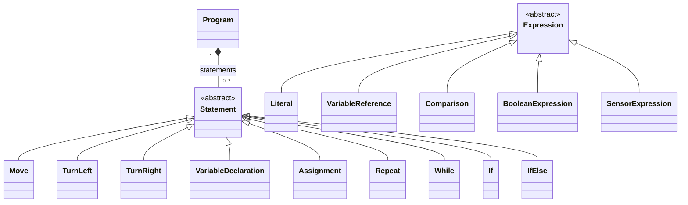

# Modelos MDE — diseño previsto

En Fase 0 no hay Ecore/GenModel/XMI ejecutables. Este documento especifica qué
deberán formalizar y probar las siguientes fases. Un diagrama o DTO no demuestra
conformidad EMF.

| Metamodelo | Clases y relaciones principales | Restricciones / entrega |
| --- | --- | --- |
| `programming.ecore` | Program contiene Statement[*]; Statement abstracto: Move, TurnLeft, TurnRight, VariableDeclaration, Assignment, Repeat, While, If, IfElse. Expression abstracta: Literal, VariableReference, Comparison, BooleanExpression, SensorExpression. | F1: Repeat.times > 0; referencias resueltas; condición booleana; ramas/cuerpos contenidos; tipos y alcance formalizados. |
| `learning.ecore` | Student → StudentModel; Concept; ConceptMastery enlaza estudiante/concepto; LearningObjective, Activity, Attempt, ErrorPattern, HintUsage y Progress. | F6: masteryScore [0,1], intentos/éxitos/fallos coherentes, prerequisitos válidos y grafo sin ciclos inválidos. |
| `context.ecore` | ContextModel contiene StudentContext, PlatformContext y EnvironmentContext. | F8: referencia al estudiante persistente; solo datos relevantes para decisión, viewport y funciones, aula/hogar opcionales. |
| `adaptation.ecore` | AdaptationRule, Event, Condition, Action, AdaptationParameters, AdaptationDecision, AdaptationExplanation. | F7: acciones cerradas, operadores tipados, prioridad, versión y activación; decisiones trazables. |
| `ui.ecore` | TaskAndDomainModel, AbstractUIModel, ConcreteUIModel y FinalUIConfiguration. | F10: valores permitidos para paneles, ayudas, disposición y navegación; sin código ejecutable libre. |

## Programas

La F1 decidirá formalmente tipos de literales, operaciones numéricas para cambiar
variables, alcance e identidad de declaraciones. Las referencias a variables
deben apuntar a una declaración visible; no son nombres de texto sin validar.
La estructura de contenido no puede compartir el mismo nodo en dos contenedores.
Los bloques iniciar delimitan Program; el adaptador no inventará semántica
incompatible con el metamodelo.

Se combinarán validación EMF/EValidator y OCL donde corresponda. La elección debe
indicar qué restricciones comprueba cada herramienta y demostrarlas sobre casos
válidos e inválidos, incluyendo límites de profundidad/tamaño.

## Estudiante y grafo

ConceptMastery contendrá masteryScore, attemptCount, successCount, failureCount,
consecutiveFailures, consecutiveSuccesses, averageTime, hintCount,
recentErrorPatterns y lastUpdated/lastInteraction. Se definirán correspondencias
con nombres de DTO para evitar contadores duplicados. Los ajustes (+0.10/+0.05/
-0.03/-0.02 como propuesta inicial) serán parámetros versionados, no constantes
dispersas; clamp [0,1] y actualizaciones idempotentes.

Concept define prerequisites, minimumMasteryToUnlock, activities y
reinforcementActivities. Semillas: SEQUENCES, VARIABLES, CONDITIONALS y LOOPS;
cada una con introducción, práctica y refuerzo. La selección considera el grafo,
no un contador de siguiente nivel. gameLevel sigue separado del dominio.

## Transformaciones y evidencia

| Cadena | Herramienta real | Pruebas exigidas |
| --- | --- | --- |
| Workspace → DTO → Program | Adaptador Java → objetos EMF | Mapeo permitido, restauración de estructura, rechazo de nodos inválidos |
| Program ↔ archivo | EMF XMIResource | Round trip, versión de metamodelo y resolución de referencias |
| Program → JavaScript | Acceleo M2T | Regeneración headless, determinismo, snapshots y sintaxis |
| DSL → modelo de reglas | Xtext | Parsing y validación, referencias/tipos/operadores/acciones inválidos |
| Tareas/dominio → AUI → CUI | ATL M2M | Conformidad de ambos destinos y trazas origen/destino |
| CUI → configuración final | Acceleo o serialización controlada documentada | Lista de propiedades/valores cerrada y renderer seguro |

No ejecutar el JavaScript mostrado. Intérprete determinista separado, con traza,
estado final, errores y métricas. Las salidas guardan versión/hash de metamodelo,
transformación, modelo fuente e IDs de nodos para poder reconstruir intentos.

La gramática Xtext debe importar `adaptation.ecore` o tener una transformación
explícita hacia ese modelo; una segunda representación incompatible no es válida.
La generación EMF/Xtext se aislará del dominio escrito a mano. No se declara
ningún runtime MDE listo hasta pasar la matriz y los ensayos de [PLAN](PLAN_IMPLEMENTACION.md).
