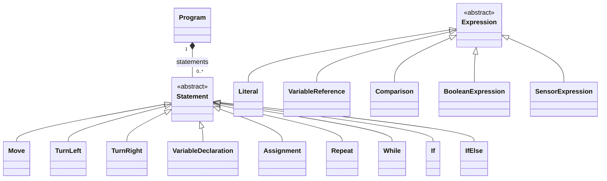

# Modelos MDE — estado y diseño previsto

## Transformación implementada: T_M2T_PROGRAM_JS

| Elemento | Valor real Fase 3 |
| --- | --- |
| Source metamodel | programming.ecore (inmutable) |
| Source root | Program EMF, XMI .programming |
| nsURI | https://mdedu.espoch.edu.ec/model/programming/1.0 |
| Technology | Acceleo 4.2.2 / AQL 8.1.2 |
| Module | com::project::mde::generator::main |
| Target | JavaScript controlado, UTF-8/LF, program.js |
| Entry | function runProgram(runtime) |
| Validation | 25 tests, cuatro golden, A/B byte-equivalent, node --check |

Proyecto separado `mde/com.project.mde.programming.generator`. Identidad por
referencias EMF/posición estructural, strings escapados como datos.
[Diseño](FASE_3_M2T_ACCELEO.md). Runtime GridWorld implementado en Fase 4, evaluación en Fase 5 y aprendizaje en Fase 6.

## Modelo implementado en Fase 6: learning.ecore

Plugin `mde/com.project.mde.learning.model`; nsURI
`https://mdedu.espoch.edu.ec/model/learning/1.0`; raíz **StudentModel** versión 1.
Diez EClasses: Student, StudentModel, Concept, ConceptMastery, LearningObjective,
Activity, Attempt, ErrorPattern, HintUsage y Progress. GenModel Java 21, 26 src-gen.

StudentModel contiene estudiante, catálogos, masteries, intentos recientes,
hintUsages y progreso. Mastery enlaza Student/Concept; Attempt enlaza Student,
Activity, Concept y ErrorPattern; Progress enlaza Activity/Concept. Catálogos
contenidos hacen el XMI autocontenido. Concept ID es EString; prerequisites y listas
de actividades principales/refuerzo admiten un grafo futuro distinto sin regeneración.
Actualmente son cuatro conceptos/actividades y cero refuerzos.

Fuente operativa: PostgreSQL normalizado (V2). StudentModelProjectionService usa
LearningFactory para reconstruir y validar EMF, luego producir DTOs REST. No copia
src-gen al backend ni persiste un blob XMI. Invariantes manuales fuera de src-gen.
Ejemplos student-a.learning y student-b.learning con estados distintos y round-trip
real, también a partir de Testcontainers. [Diseño](FASE_6_MODELO_ESTUDIANTE.md) y
[evidencia/hashes](VERIFICACION_FASE_6.md). adaptation.ecore y context.ecore pendientes.

## Diseño histórico de Fase 0

Las previsiones siguientes son históricas; para programación rigen Fases 1, 2 y 3.

En Fase 0 no hay Ecore/GenModel/XMI ejecutables. Este documento especifica qué
deberán formalizar y probar las siguientes fases. Un diagrama o DTO no demuestra
conformidad EMF.

| Metamodelo | Clases y relaciones principales | Restricciones / entrega |
| --- | --- | --- |
| `programming.ecore` | Program contiene Statement[*]; Statement abstracto: Move, TurnLeft, TurnRight, VariableDeclaration, Assignment, Repeat, While, If, IfElse. Expression abstracta: Literal, VariableReference, Comparison, BooleanExpression, SensorExpression. | F1: Repeat.times > 0; referencias resueltas; condición booleana; ramas/cuerpos contenidos; tipos y alcance formalizados. |
| `learning.ecore` | Student → StudentModel; Concept; ConceptMastery enlaza estudiante/concepto; LearningObjective, Activity, Attempt, ErrorPattern, HintUsage y Progress. | F6: masteryScore [0,1], intentos/éxitos/fallos coherentes, prerequisitos válidos y grafo sin ciclos inválidos. |
| `context.ecore` | ContextModel contiene StudentContext, PlatformContext y EnvironmentContext. | F8: referencia al estudiante persistente; solo datos relevantes para decisión, viewport y funciones, aula/hogar opcionales. |
| `adaptation.ecore` | AdaptationRule, Event, Condition, Action, AdaptationParameters, AdaptationDecision, AdaptationExplanation. | F7: acciones cerradas, operadores tipados, prioridad, versión y activación; decisiones trazables. |
| `ui.ecore` | TaskAndDomainModel, AbstractUIModel, ConcreteUIModel y FinalUIConfiguration. | F10: valores permitidos para paneles, ayudas, disposición y navegación; sin código ejecutable libre. |

## Programas

```mermaid
classDiagram
  class Program
  class Statement { <<abstract>> }
  class Expression { <<abstract>> }
  Program "1" *-- "0..*" Statement : statements
  Statement <|-- Move
  Statement <|-- TurnLeft
  Statement <|-- TurnRight
  Statement <|-- VariableDeclaration
  Statement <|-- Assignment
  Statement <|-- Repeat
  Statement <|-- While
  Statement <|-- If
  Statement <|-- IfElse
  Expression <|-- Literal
  Expression <|-- VariableReference
  Expression <|-- Comparison
  Expression <|-- BooleanExpression
  Expression <|-- SensorExpression
```

La F1 decidirá formalmente tipos de literales, operaciones numéricas para cambiar
variables, alcance e identidad de declaraciones. Las referencias a variables
deben apuntar a una declaración visible; no son nombres de texto sin validar.
La estructura de contenido no puede compartir el mismo nodo en dos contenedores.
Los bloques iniciar delimitan Program; el adaptador no inventará semántica
incompatible con el metamodelo.

Se combinarán validación EMF/EValidator y OCL donde corresponda. La elección debe
indicar qué restricciones comprueba cada herramienta y demostrarlas sobre casos
válidos e inválidos, incluyendo límites de profundidad/tamaño.

## Estudiante y grafo

ConceptMastery contendrá masteryScore, attemptCount, successCount, failureCount,
consecutiveFailures, consecutiveSuccesses, averageTime, hintCount,
recentErrorPatterns y lastUpdated/lastInteraction. Se definirán correspondencias
con nombres de DTO para evitar contadores duplicados. Los ajustes (+0.10/+0.05/
-0.03/-0.02 como propuesta inicial) serán parámetros versionados, no constantes
dispersas; clamp [0,1] y actualizaciones idempotentes.

Concept define prerequisites, minimumMasteryToUnlock, activities y
reinforcementActivities. Semillas: SEQUENCES, VARIABLES, CONDITIONALS y LOOPS;
cada una con introducción, práctica y refuerzo. La selección considera el grafo,
no un contador de siguiente nivel. gameLevel sigue separado del dominio.

## Transformaciones y evidencia

| Cadena | Herramienta real | Pruebas exigidas |
| --- | --- | --- |
| Workspace → DTO → Program | Adaptador Java → objetos EMF | Mapeo permitido, restauración de estructura, rechazo de nodos inválidos |
| Program ↔ archivo | EMF XMIResource | Round trip, versión de metamodelo y resolución de referencias |
| Program → JavaScript | Acceleo M2T | Regeneración headless, determinismo, snapshots y sintaxis |
| DSL → modelo de reglas | Xtext | Parsing y validación, referencias/tipos/operadores/acciones inválidos |
| Tareas/dominio → AUI → CUI | ATL M2M | Conformidad de ambos destinos y trazas origen/destino |
| CUI → configuración final | Acceleo o serialización controlada documentada | Lista de propiedades/valores cerrada y renderer seguro |

No ejecutar el JavaScript mostrado. Intérprete determinista separado, con traza,
estado final, errores y métricas. Las salidas guardan versión/hash de metamodelo,
transformación, modelo fuente e IDs de nodos para poder reconstruir intentos.

La gramática Xtext debe importar `adaptation.ecore` o tener una transformación
explícita hacia ese modelo; una segunda representación incompatible no es válida.
La generación EMF/Xtext se aislará del dominio escrito a mano. No se declara
ningún runtime MDE listo hasta pasar la matriz y los ensayos de [PLAN](PLAN_IMPLEMENTACION.md).

## Fase 7 implementada — adaptation.ecore

Namespace `https://mdedu.espoch.edu.ec/model/adaptation/1.0`.
Plugin separado `com.project.mde.adaptation.model`; GenModel Java 21; 44 Java generados.

| EClass | Estructura |
| --- | --- |
| AdaptationRuleSet | name/version; contiene rules[*] |
| AdaptationRule | id/name/version/enabled/priority; contiene event, condition y actions[*] |
| Event | EventType cerrado |
| Condition | Abstracta |
| ComparisonCondition | attribute, ComparisonOperator y Value contenido |
| LogicalCondition | left/right Condition contenidos y LogicalOperator |
| NotCondition | operand Condition contenido |
| Value | Abstracta |
| StringValue | EString |
| IntegerValue | ELong |
| DecimalValue | EBigDecimal |
| BooleanValue | EBoolean |
| Action | ActionType y AdaptationParameters contenido |
| AdaptationParameters | HintLevel/FeedbackStyle opcionales unsettable |
| AdaptationDecision | ruleId, actions contenidas y explicación opcional; solo representación formal |
| AdaptationExplanation | ruleId, reason, evidence[*] |

Enums: EventType (ATTEMPT_EVALUATED), ComparisonOperator (EQ/NE/GT/GE/LT/LE/CONTAINS),
LogicalOperator (AND/OR), ActionType (diez acciones), HintLevel (CONCEPTUAL/GUIDED/DIRECT),
FeedbackStyle (CONCISE/EXPLANATORY). Relaciones de composición internas; sin proxies
externos necesarios. Cada regla exige evento, condición y al menos una acción.

La gramática AdaptationRules.xtext importa este namespace y retorna las EClasses
existentes. Xtext crea directamente estos EObjects; no existe segundo AST canónico.
El motor usa el árbol formal de Condition y Value, nunca una condición String sin
semántica. Atributos String están restringidos por ContextAttribute; conceptos y
patrones se validan contra los catálogos backend reales.

[DSL y reglas](REGLAS_ADAPTACION.md) · [Implementación](FASE_7_DSL_REGLAS_ADAPTACION.md).
Programming y learning Ecore/GenModel/src-gen permanecen intactos. Las secciones
conceptuales históricas de este documento no amplían el alcance implementado:
continúan cuatro conceptos, cuatro actividades y cero refuerzos reales.

## Fase 8 — ContextModel y decisión sin adaptación

Nuevo plugin `com.project.mde.context.model`, nsURI
`https://mdedu.espoch.edu.ec/model/context/1.0`, GenModel Java 21 y 14 Java src-gen.
Cuatro EClasses: ContextModel contiene StudentContext, PlatformContext y
EnvironmentContext. Snapshot transitorio de una decisión, sin copiar StudentModel.
ContextFactory crea los objetos; ContextProjectionService valida y deriva el
RuleEvaluationContext existente. Sin referencias externas/proxies ni fechas de entrada.

Excepción autorizada por el usuario tras detectar el bloqueo NO_ADAPTATION:
AdaptationDecision.ruleId 0..1, actions 0..*, AdaptationExplanation.ruleId 0..1.
Se regeneró EMF: cambian tres fuentes, permanecen 44 en total. GenModel y namespace
adaptation no cambian; relajación compatible con todos los modelos previos.
Gramática y reglas Xtext intactas. Metadata de auditoría/contribuciones vive en DTO/JPA;
la decisión y explicación principales son EObjects adaptation existentes.

[Diseño Fase 8](FASE_8_ADAPTATION_MANAGER.md) y hashes en
[Verificación Fase 8](VERIFICACION_FASE_8.md). Las restricciones históricas de Fase 7
sobre decisiones vacías quedan reemplazadas únicamente por esta autorización.

## Modelo UI de Fase 10

Plugin `mde/com.project.mde.ui.model`; nsURI `https://mdedu.espoch.edu.ec/model/ui/1.0`.
EClasses: TaskAndDomainModel, AbstractUIModel, AbstractElement, ConcreteUIModel,
ConcreteElement, FinalUIConfiguration. Containment: AbstractUIModel.elements y
ConcreteUIModel.elements. Enums: AbstractKind, ConcreteKind, HintPanelMode,
FeedbackDetailLevel, ActivityLayout, NavigationMode, DifficultyMode, TutorMode,
TransitionMode, HintStage. GenModel Java 21; fuentes producidas por EMF.
Dos transformaciones ATL reales separan necesidades, UI abstracta y concreta.
El backend crea FinalUIConfiguration como overlay de la decisión resuelta.
Véase [Fase 10](FASE_10_UI_ADAPTATIVA.md) y sus ejemplos XMI.
